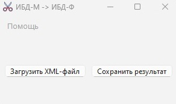

<br>
## 📋 ИЗ ИБД-М В ИБД-Ф

***1. На вход получаем XML-файл из портала ИБД-М определенного формата. Сокращенный вид файла:***
```
- <Applicant type="Единый портал гос.услуг" role="Лично"> # type - вид заявлений на сайте гос.услуг
- <CPSurname>Иванов</CPSurname>                           # Действующая фамилия
- <CPName>Иван</CPName>                                   # Действующее имя
- <CPPatronymic>Иванович</CPPatronymic>                   # Действующее отчество
- <CPBirthday>03.04.1998</CPBirthday>                     # Дата рождения
- <CPLastFIO>
  - <CPLSurname>Сидоров</CPLSurname>                      # Старая фамилия
  - <CPLName>Павел</CPLName>                              # Старое имя № 1
  - <CPLName>Владимир</CPLName>                           # Старое имя № 2
- </CPLastFIO>
```

***2. Из XML-файла создаётся 3 текстовых файла, в зависимости от 3 видов заявлений:***
- ЕПГУ (единый портал государственных услуг)
- МФЦ (многофункциональный центр)
- Физ. лицо (физическое лицо)

***3. На примере входного XML-файла, содержание итогового ЕПГУ-файла будет таким:***
- иванов;иван;иванович;1998;;
- сидоров;павел;иванович;1998;;
- сидоров;владимир;иванович;1998;;

***4. Сборка:***
- Под OS Windows x64: 
pyinstaller main.py --windowed --name ibdm-ibdf-winx64-1.0 --version-file version_for_pyinstaller --onefile -i docs\scissor.ico

***5. Внешний вид:***
- Темная тема:<br>
<br>
- Светлая тема:<br>
